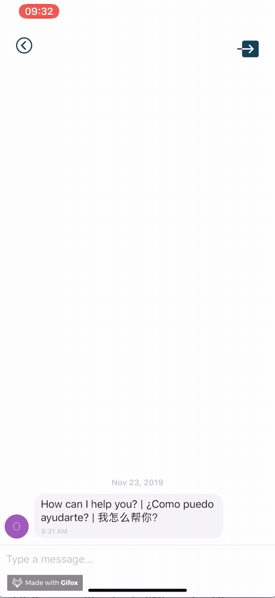

# OYA: Connecting Monolingual users with Bilingual volunteers

  

 
##### Live app here: https://snack.expo.io/@ingan/oya-app:-translation-app
##### Server Code: https://github.com/Avpaige/OyaServer
 

#### Volunteer view 

  

#### User view 

  

#### Chat example 

  

#### WHAT IS OYA?
Oya is a FREE peer to peer translation service that connects you with bilingual speakers able to provide you with translation and context either for simple phrases or to help you facilitate a conversation. Whether it’s to better communicate with a loved one, coworker or make a request of your landlord. OYA voluteeners will help you with what to say and how to say it.

#### HOW MUCH IS IT?
OYA is a totally free service. Volunteers should never ask you for payment or other personal or sensitive information. If they do, please let us know right away and end your session.

#### WHAT LANGUAGES DO YOU SUPPORT?
Currently we support translations for English to/from Spanish and English to/from Madarin Chinese, though our hope is to expand to additional languages as we grow the OYA community.

#### DO YOU PROVIDE LEGAL ADVICE?
No, the intention of OYA is not to provide advice, legal or otherwise. OYA volunteers have not been certified or verified as legal professionals.

#### DO YOU REPORT OR SHARE ANY INFORMATION DISCUSSED WITH LAW ENFORCEMENT OR OTHER AGENCIES?
###### Our mission is to bring people together without fear. 

* The only identifiable information we collect is from volunteers to verify that their intention is to give accurate information to those seeking assistance. Users do not need to supply any personal information to use OYA. 

* Information such as immigration status are not collected, stored or reported for volunteers or users. Volunteers should never ask you for personally identifiable or immigration status information. If they do, please let us know right away and end your session.

* That being said, if you make threats or ask volunteers to assist with illegal activities they will be forced to end your session and pending the severity of the comments, those may be reported to the police.

## Technologies Used
* React Native
* Node
* Express
* MongoDB
* MySQL
* Google Translate API

## Future Developements
* Allow users to:
  * Create accounts
  * Send documents to volunteers
  * Make phone calls to translators
* Expand features into document review and phone calls
* Allow customization of Volunteer accounts
* Be able to support multiple languages
